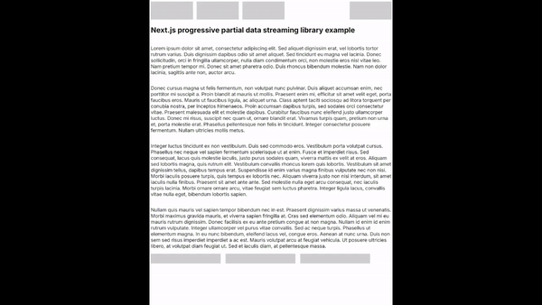
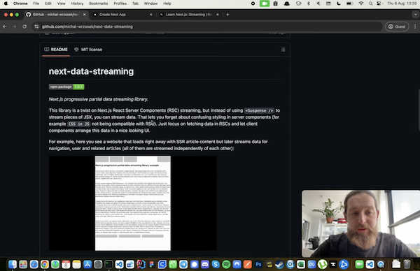

# next-data-streaming

[](https://badge.fury.io/js/next-data-streaming)

_Next.js progressive partial data streaming library._

This library is a twist on Next.js React Server Components (RSC) streaming, but instead of using `<Suspense />` to stream pieces of JSX, you can stream data. That lets you forget about confusing styling in server components (for example `CSS in JS` not being compatible with RSC). Just focus on fetching data in RSCs and let client components arrange this data in a nice looking UI.

For example, here you see a website that loads right away with SSR article content but later streams data for navigation, user and related articles (all of them are streamed independently of each other):



YouTube video about this library:

[](https://youtu.be/Mim3BTPZkcw)

## How to use it?

Install library:

```bash
npm i next-data-streaming
```

Place `<NextDataStreaming />` component in your page. Here's an [example](example-nextjs/src/app/page.tsx):

```typescript
import { NextDataStreaming } from 'next-data-streaming';
import { Client } from './client';
// and some other imports ...

export default function Page() {
  return (
    <NextDataStreaming
        // Some data that will be available right away (no streaming)
      data={{
        article: article,
      }}
      // Some data that will be independently streamed to Client component
      dataStream={{
        navigation: new Promise<NavigationItem[]>((resolve) => setTimeout(() => resolve(navigation), 2000)),
        user: new Promise<User>((resolve) => setTimeout(() => resolve(user), 3000)),
        relatedArticles: new Promise<RelatedArticle[]>((resolve) => setTimeout(() => resolve(relatedArticles), 4000)),
      }}
      // Your Client component that will receive `data` and `dataStream` as props
      ClientComponent={Client}
    />
  );
}
```

Create your Client component. Don't forget to place `"use client"` directive on top of this component file. Use `ClientComponentProps` to properly type your props. Here's an [example](example-nextjs/src/app/client.tsx):

```typescript
'use client';

import { ClientComponentProps } from 'next-data-streaming';
// and some other imports ...

type ClientProps = ClientComponentProps<
  {
    article: Article;
  },
  {
    navigation: NavigationItem[];
    user: User;
    relatedArticles: RelatedArticle[];
  }
>;

export const Client = ({ data: { article }, dataStream: { navigation, user, relatedArticles } }: ClientProps) => {
  return (
    <main>
      <Navigation navigation={navigation} user={user} />
      <Article article={article} />
      <RelatedArticles relatedArticles={relatedArticles} />
    </main>
  );
};
```

And that's it. Data is `data` will be available right away, and data in `dataStream` will initially be `undefined` and become target types with time, so in your client components you have to handle loading state, for [example](example-nextjs/src/components/related-articles.tsx):

```typescript
export const RelatedArticles = ({ relatedArticles }: RelatedArticlesProps) => (
  <Wrapper>
    {relatedArticles
      ? relatedArticles.map(({ title, content, href }, index) => (
          <Link key={index} href={href}>
            <Item>
              <Title>{title}</Title>
              <Paragraph>{content}</Paragraph>
            </Item>
          </Link>
        ))
      : new Array(3).fill(null).map((_, index) => <Item key={index} $isLoading />)}
  </Wrapper>
);
```

## How this library works?

Inside, this library converts `dataStream` promises to components surrounded by `<Suspense />`. The contents of `<Suspense />` are streamed as stringified JSON to a bunch of hidden `<div />` tags. Later, on client side, the library extract contents of these `<div />` tags to get the data. Currently `MutationObserver` is used to listen to changes to streamed data. Hacky as hell but it seems to work just right.

- [Server part](src/server-part.tsx)
- [Client part](src/client-part.tsx)

## Final note

If you have some ideas how to improve the library, open an Issue or PR. Also, you can directly write to me:

[https://github.com/michal-wrzosek/](https://github.com/michal-wrzosek/)

michal@wrzosek.pl

---

This library was built using [react-component-lib](https://github.com/michal-wrzosek/react-component-lib)
